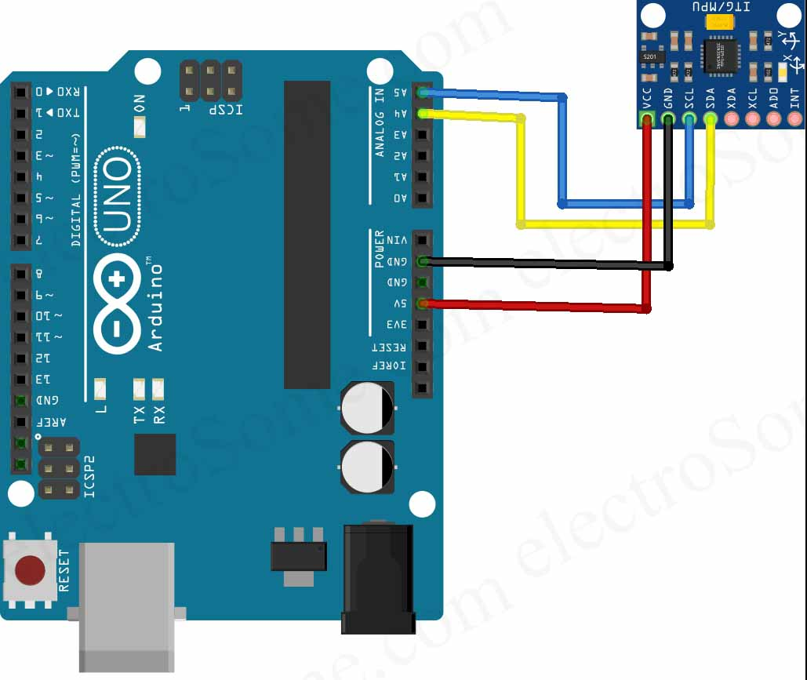

# Determinación de la orientación de un robot con MPU6050
---
## Objetivo general:
- Obtener los ángulos Roll, Pitch and Yaw para conocer la orientación de un objeto en movimiento por medio del IMU MPU6050
## Objetivos específicos:
- Lograr obtener la variación de giro respecto al eje Z sin utilizar un magnetómetro
- Aplicar conocimientos previos respecto al datasheet del MPU6050, su principio de funcionamiento y la obtención del R-P-Y
- Identificar cuál método de obtencion de ángulos es el mejor para determinar la orientación del MPU6050
- Identificar y aplicar el filtro más óptimo para determinar la orientación de la MPU6050
---
1. ## **Primer avance para determinar la orientación**
_Trabajando con 1 MPU6050 conexionado a la raspberry pi pico W_

Durante esta instancia se decidió tomar el rumbo de trabajar con el microcontrolador Raspberry pi pico W junto al lenguaje micropython
y usar el método de los ángulos de Euler para determinar el Roll, Pitch and Yaw. 

**Inconvenientes:**
1. Los ángulos de euler están estrechamente ligados a la gravedad a la que esta sometido el IMU, además que su uso genera el fenómeno "bloqueo del cardán"
2. el cual refiere al hecho cuando 2 ejes se alinean, lo que restringe la libertad de rotación.
3. Límtes en las librerías disponibles para el lenguaje micropython

Es por esto que la obtención de la variación de giro respecto al eje Z no pudo llevarse a cabo.

*__Esta parte del trabajo es respaldada por los archivos .py que contiene la carpeta Avance1_Orientación.__*

2. ## **Segundo avance para determinar la orientación**
_Trabajando con 2 MPU6050 conexionado a la raspberry pi pico W_

Se optó por integrar un MPU6050 más al sistema (es con esto que se observó la incidencia del principio de funcionamiento del MPU6050 para el cálculo de los R-P-Y con los ánngulos de euler)
sin embargo, a pesar todo, se logra realizar la comunicación de 2 imus para la raspbarry considerando que además de revisar el datasheet del MPU6050 también se tuvo que revisar el datasheet de los registros del mpu.
En cuanto al conexionado, se tuvo que habilitar el pin ADO del MPU6050 a través del pin de 3.3V de la raspberry.

*__Esta parte del trabajo es respaldada por el archivo .py que contiene la carpeta Orientación IMU.__*

3. ## **Resultado final para la determinación de la orientación**
_Trabajando con 1 MPU6050 conexionado al Arduino UNO_

Finalmente se escoge trabajar con el método de cuaternios en conjunto con el microcontrolador Arduino UNO (esto debido a la observación antes dicha del límite en librerias matemáticas y comunicación IMU MPU6050 con micropython.
El código main que finalmente muestra la variación de giro respecto al eje X-Y-Z implementa el algoritmo AHRS-Mahony que utiliza la teoría de cuaternios para determinar la orientación del sensor en el espacio tridimensional.
A través de la función Mahony_update(), el código realiza la actualización del quaternion del sensor utilizando los datos del acelerómetro y el giroscopio. 
Posteriormente, en la función loop(), se convierten los cuaternios actualizados en ángulos de Euler (yaw, pitch, roll) para representar la orientación del sensor en grados solamente a fin de visualización o monitoreo. 

### ¿Qué es el algoritmo AHRS-Mahony?
---
AHRS significa "Attitude and Heading Reference System", que se traduce al español como "Sistema de Referencia de Actitud y Rumbo". Este sistema se utiliza para determinar la orientación o actitud de un objeto en el espacio tridimensional. 
AHRS-Mahony es un algoritmo específico de filtrado y fusión de sensores utilizado para estimar la orientación de un objeto en movimiento utilizando datos de sensores inerciales, como acelerómetros y giroscopios. 
El objetivo de AHRS-Mahony es calcular la orientación espacial del objeto (por ejemplo, un avión, un vehículo, un robot o un sensor) en términos de un conjunto de valores que describen su rotación en torno a los ejes del espacio tridimensional.
Este algoritmo se basa en el uso de cuaternios para representar la orientación del objeto.
El seudocódigo del algoritmo es:
1. Toma de datos del sensor
2. Filtrado Proporcional e integral: En esta parte se estima el vector de referencia de la gravedad en la estructura del objeto. Esto ayuda a separar la aceleración debida a la gravedad de otras aceleraciones. 
3. Actualización del Quaternion: Este se actualiza en función de las velocidades angulares medidas y se integra en el tiempo
4. Renormalización del Quaternion: Con fin de estabilizar precisar el cálculo. Que se renormaliza en cada iteración se asegura que tenga una unidad de quaternion.
5. Conversión a Ángulos de Euler: Opcionalmente, después de actualizar el quaternion, AHRS-Mahony puede convertir los cuaternios en ángulos de Euler (yaw, pitch, roll) para proporcionar una representación más fácilmente comprensible de la orientación del objeto.

El algoritmo AHRS-Mahony es ampliamente utilizado en aplicaciones de robótica, navegación, realidad virtual, simuladores y sistemas de control donde se requiere una estimación precisa de la orientación espacial del objeto en movimiento.

_Es importante señalar que, si bien AHRS-Mahony es una solución eficiente y precisa, también existen otros algoritmos AHRS que utilizan enfoques diferentes, como el filtro de Kalman extendido (EKF) y el filtro complementario, según los requisitos específicos de cada aplicación._

## Seudocódigo de main_final.imu
### **Aspectos a considerar:**
- El siguiente código solamente utiliza la libreria Wire.h que viene de forma predeterminada en Arduino IDE. Esta librería permite comunicarse con dispositivos por bus I2C usando las lineas: SDA (datos) y SCL (reloj)
- Se agregan las líneas de código para la calibración del MPU tomando 500 datos
- Se agregan las líneas de código para la transformación a grados y condicionales que muestren un intervalo de [-90° - 90°] en la variación de R-P-Y.
El seudocodigo consiste en:

| Sección | Función |
|--------------|--------------|
| Configuración del sensor | En la función **setup**, se inicializa el sensor MPU6050 y se configura para despertar y comenzar utilizando los registros del mismo |
| Toma de Datoa    | En la función loop(), se recopilan los datos del acelerómetro y el giroscopio del MPU-6050. Estos datos son las aceleraciones lineales en los ejes X, Y y Z (ax, ay, az) y las velocidades angulares de giro (gx, gy, gz). |
| Calibración del Giroscopio | Si cal_gyro es 1, el código realiza una calibración del giroscopio en reposo y calcula los valores de offset (G_off) para eliminar las lecturas no deseadas del giroscopio en estado estacionario. |
| Actualización del Algoritmo AHRS-Mahony | Procesamiento de los datos del acelerómetro y giroscopio para actualizar el algoritmo AHRS-Mahony en la función **Mahony_update()**. |
| Cálculos de Ángulos de Euler | Se convierten los valores quaternion actualizados en ángulos de Euler (yaw, pitch and roll) en la función **(loop)** representando la orientación del sensor en grados. Es importante señalar que la guiñada convencional es positiva en dirección horaria desde el Norte terrestre. Esta conversión está previamente ajustada a eso, no significa que la MPU-6050 esté notando donde está el Norte sin un magnetómetro.
| Impresión de Ángulos | Los ángulos de Euler calculados se imprimen en el monitor serie de Arduino cada cierto intervalo (print_ms) para que puedan ser monitoreados o visualizados en tiempo real. |

## Conexionado MPU6050 - ARDUINO UNO

