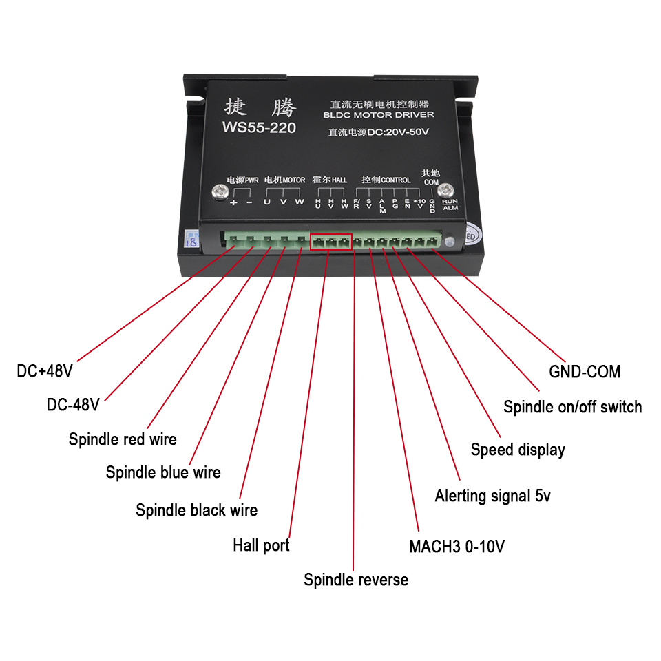
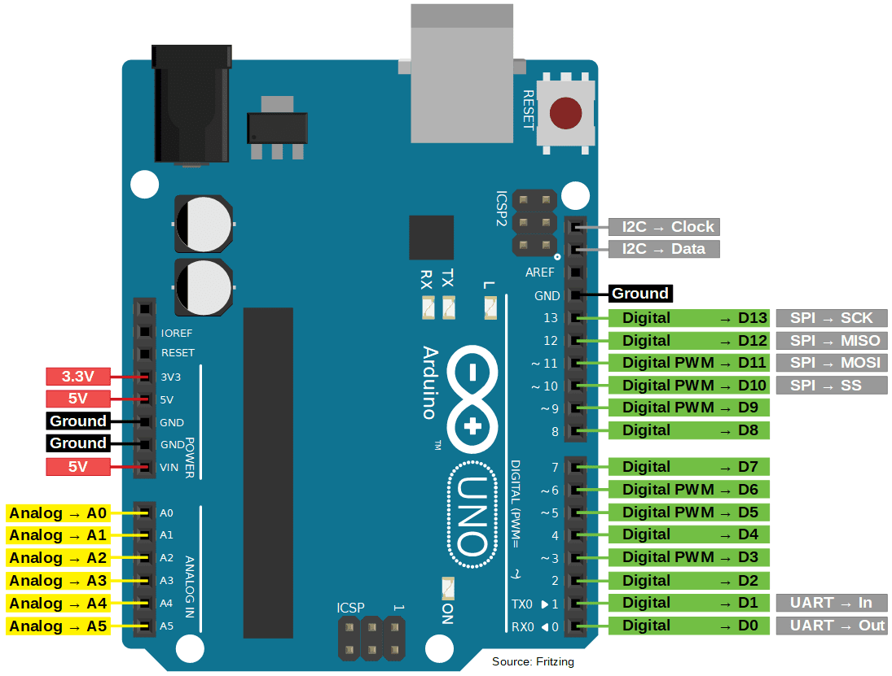
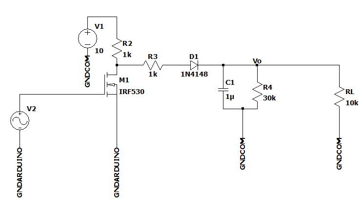

# Diseño de Hardware y Control de Motor
**Autor**: Alan R. Montt

***

## Control de Motor

Para la movilidad se consideraron dos motores **BLDC** de una HoverBoard, las cuales cada una sera accionada por drivers **WS55-220** cuya alimentacion es de **36-40V (4400mAh)**. 

Las conexiones a considerar son:
- DC $\pm$ 48V : Entradas de Bateria
- U,V,W : Fases A,B,C de BLDC
- S/V ó MACH3 0-10V: Control de Velocidad mediante PWM proveniente de Arduino
- Spindle ON/OFF Switch: Encendido y apagado del driver mediante señal de voltaje.

El driver provee una alimentacion de +10V respecto a su GND-COM por lo que servira para realizar una configuracion Pull-up para acondicionar el arduino.

***
## Diseño de Hardware

### Hardware a utilizar
En un inicio se considerara el uso de Arduino UNO para cada motor (posible modificacion a ESP32). En el microcontrolador se trabajaran con los pines D2 y D4 como receptores del Encoder BLDC ya que sirven para **Interrupciones**. Se utilizara D9 como **Salida PWM** que se conectara a **S/V** de **WS55-220**. Se esta considerando **D1(RX)** y **D0(TX)** para comunicarse mediante **UART** entre Arduinos, de esta forma obtener las mediciones de ambas ruedas y mostrarla mediante comunicacion **Serial** en un PC en primera instancia.

Para acondicionar la salida PWM para el Driver se utilizara el siguiente circuito acondicionar, donde la señal PWM activara el NMOS (Considerando rango inverso, es decir, 255-0), al activar y desactivar el NMOS, el condensador se encargara de establecer el voltaje maximo, el diodo impedira la corriente que fluya de la descarga de C1 al NMOS. Se podra de esta manera regular la velocidad del BLDC 

### Diseño PCB

Mediante Autodesk EAGLE se diseñara uno o dos PCB que permitiran el flujo de corriente de las baterias mediante "zonas" o "regiones" de voltaje, ademas de establecer poligonos de GND para disipar el calor en caso de proteccion.