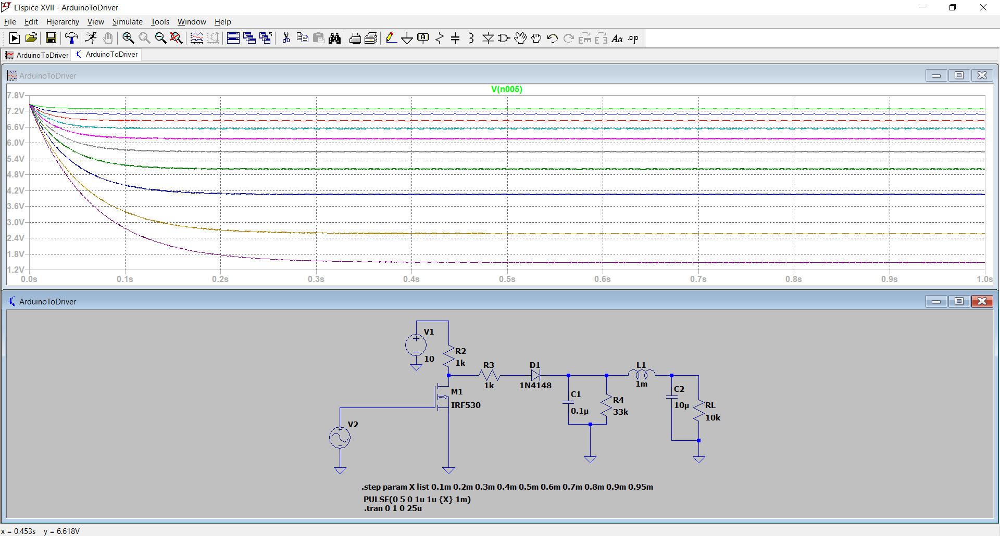

# Diseño de Hardware y Control de Motor
**Autor**: Alan R. Montt

***

## Control de Motor

Para la movilidad se consideraron dos motores **BLDC** de una HoverBoard, las cuales cada una sera accionada por drivers **WS55-220** cuya alimentacion es de **36-40V (4400mAh)**. 

Las conexiones a considerar son:
- DC $\pm$ 48V : Entradas de Bateria
- U,V,W : Fases A,B,C de BLDC
- S/V ó MACH3 0-10V: Control de Velocidad mediante PWM proveniente de Arduino
- Spindle ON/OFF Switch: Encendido y apagado del driver mediante señal de voltaje.

El driver provee una alimentacion de +10V respecto a su GND-COM por lo que servira para realizar una configuracion Pull-up para acondicionar el arduino.

***
## Diseño de Hardware

### Hardware a utilizar
En un inicio se considerara el uso de Arduino UNO para cada motor (posible modificacion a ESP32). En el microcontrolador se trabajaran con los pines D2 y D4 como receptores del Encoder BLDC ya que sirven para **Interrupciones**. Se utilizara D9 como **Salida PWM** que se conectara a **S/V** de **WS55-220**. Se esta considerando **D1(RX)** y **D0(TX)** para comunicarse mediante **UART** entre Arduinos, de esta forma obtener las mediciones de ambas ruedas y mostrarla mediante comunicacion **Serial** en un PC en primera instancia.

Para acondicionar la salida PWM para el Driver se utilizara el siguiente circuito acondicionar, donde la señal PWM activara el NMOS (Considerando rango inverso, es decir, 255-0), al activar y desactivar el NMOS (IRF530), el condensador se encargara de establecer el voltaje maximo, el diodo impedira la corriente que fluya de la descarga de C1 al NMOS. Se podra de esta manera regular la velocidad del BLDC 

La salida de **Vo** permitira regular la velocidad del motor, a su vez mediante el encoder obtendremos las mediciones del **Hall A** y **Hall B** que son conectadas mediante **Pull Up** a los terminales 2 y 4 del MCU. Mediante el firmware programado podremos determinar los pulsos por unidad de tiempo y determinar el RPM medido. Es decir, logramos acondicionar nuestra muestra para poder obtener la velocidad de la rueda, de esta manera ya se puede aplicar un Control Automatico mediante un controlador PI.

#### Seguimiento de Trayectoria dada la medicion RPM

Acondicionada la muestra, se puede realizar una prueba dando coordenadas al azar dentro de un plano que representen un camino, un tiempo transcurrido y velocidades. 

### Diseño PCB

Se probo en laboratorio mediante protoboard ocupar una inductancia de 18mH y se obtuvo una respuesta ruidosa, por lo que cambiamos L1 a 68uH y C2 a 47uF, lo cual nos entrego buen rendimiento. En general los componentes actualizados son:

- C1 = 0.1uF
- C2 = 47uF
- D1 = 1N4007
- R2 = R3 = 1k OHM
- R4 = 33k OHM
- RL = 10k OHM
- L1 = 68uH 
- M1 = IRF520

Mediante Autodesk EAGLE se diseñara un PCB que permitira acondicionar la señal segun lo simulado en LTSpice, ademas se incluyeron los Arduinos, conexiones pull-up para activar el F/R del WS55-220, entradas para recibir las velocidades de la Nvidia Jetson, interruptor de apagado y encendido.

Obtenemos el PCB de 2 capas proximo a fabricar

El modelo 3D de la placa es el siguiente:
- TOP LAYER:

- BOTTOM LAYER:

